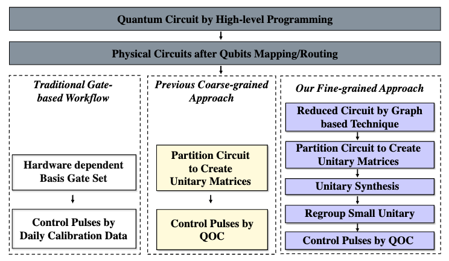

# <p align="center">[EPOC: A Novel Pulse Generation Framework Incorporating Advanced Synthesis Techniques for Quantum Circuits](https://arxiv.org/pdf/2405.03804)</p>

<p align="left">
<a href="https://arxiv.org/pdf/2405.03804" alt="arXiv">
    </a>
</p>

EPOC is a continuation of the previous work [AccQOC](https://arxiv.org/pdf/2003.00376). 
It is a novel pulse generation framework that incorporates advanced synthesis techniques for quantum circuits. 
On average, EPOC is able to achieve a __31.74%__ reduction in circuit latency compared with the state-of-the-art pulse generation framework, [PAQOC](https://people.cs.rutgers.edu/zz124/assets/pdf/hpca23.pdf).

<p align="center">
 <br>
<small>The workflow of EPOC</small>
</p>

## File Preparation

1. Benchmark

    It's recommended to fork the [benchmark](https://github.com/pnnl/QASMBench) repository to build the pulse library. 
    The final benchmarks plotted in the paper which are copied from [PAQOC](https://people.cs.rutgers.edu/zz124/assets/pdf/hpca23.pdf) are stored in "bench" folder.

2. Pulse Library

    The pulse library is a CSV file that contains the pulse information, which  should have following columns:
    - unitary
    - total_time
    - fidelity
    - compilation_time

    A sample pulse library is provided in "pulse_lib.csv".

3. Performance Benchmark

    The performance benchmark is a CSV file that contains the performance of EPOC, which should have following columns:
    - path
    - latency
    - latency_group
    - compilation_time
    - compilation_time_group
    - fidelity
    - fidelity_group

    A sample performance benchmark is provided in "performance_bench.csv".

## Environment Setup

1. Create virtual environment
    ```Shell
    conda create -n <env_name> python=3.8
    conda activate <env_name>
    ```
2. Install quantum optimal control package
    ```Shell
    cd PY3_quantum-optimal-control
    python setup.py install
    ```
3. Install other dependencies
    ```Shell
    cd ..
    pip install -r requirements.txt
    ```
## Running EPOC

Several parameters are required to run EPOC:
- `--maxsize`: the maximum partition size
- `--dir`: the directory of the benchmark
- `--filepath`: the path to the pulse library
- `--dest`: the destination to write the performance benchmark
```Shell
 python run_epoc_bench.py --maxsize=4 --dir="bench" --filepath="pulse_lib.csv"  --dest="performance_bench.csv"           
```

## Code Contributors

Yuchen Zhu, Jinglei Cheng

## Contact

Jinglei Cheng cheng636@purdue.edu
Yuchen Zhu yuchen.zhu7k@gmail.com

## Citation

```BibTeX
@misc{cheng2024epoc,
      title={EPOC: A Novel Pulse Generation Framework Incorporating Advanced Synthesis Techniques for Quantum Circuits}, 
      author={Jinglei Cheng and Yuchen Zhu and Yidong Zhou and Hang Ren and Zhixin Song and Zhiding Liang},
      year={2024},
      eprint={2405.03804},
      archivePrefix={arXiv},
      primaryClass={quant-ph}
}
```

## Acknowledgement

Our implementation is based on [BQSKit](https://github.com/BQSKit/bqskit), [PyZx](https://github.com/Quantomatic/pyzx), and [GRAPE-Tensorflow](https://github.com/SchusterLab/quantum-optimal-control).
